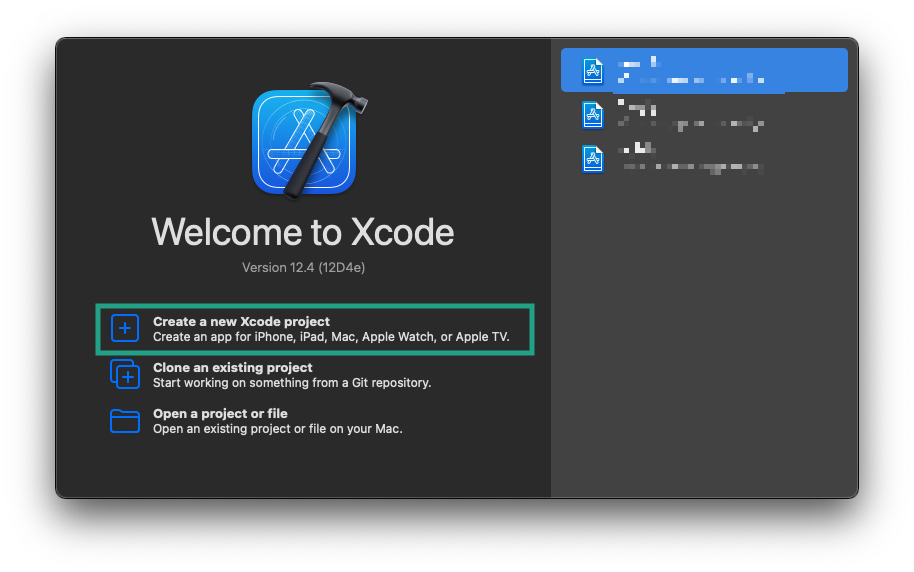
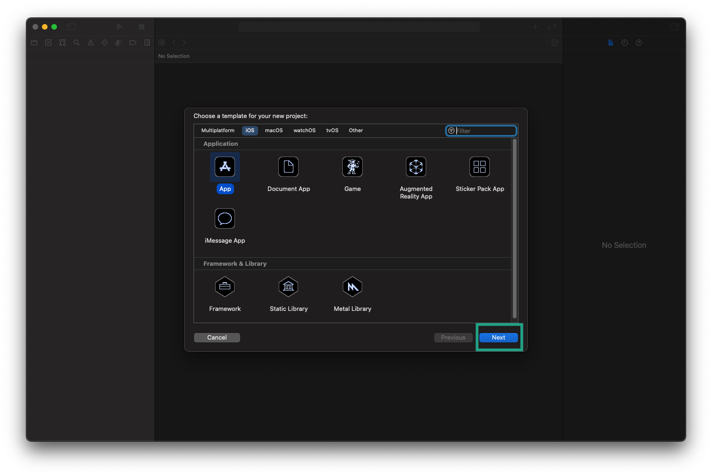
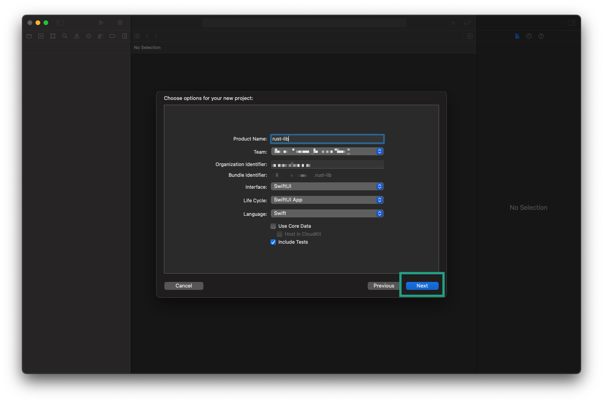
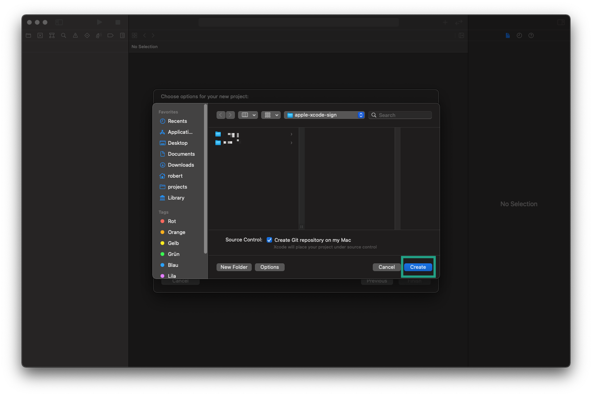
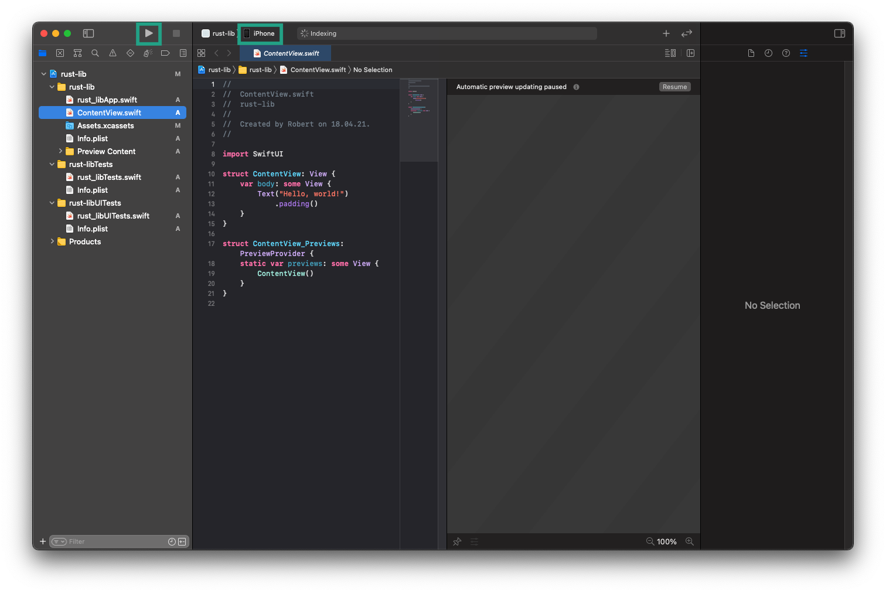
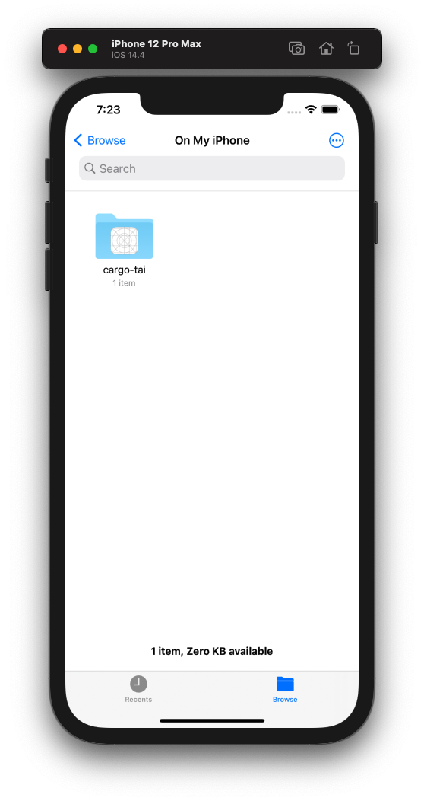
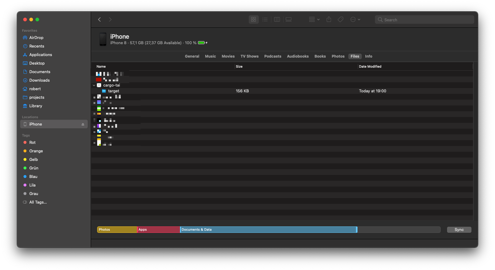

# Documentation

- [Documentation](#documentation)
  - [Installation](#installation)
  - [Usage](#usage)
    - [iOS](#ios)
      - [Setup (real device only)](#setup-real-device-only)
      - [Running tests on iOS](#running-tests-on-ios)
      - [Running benchmarks on iOS](#running-benchmarks-on-ios)
    - [Android](#android)
      - [Setup (real device only)](#setup-real-device-only-1)
      - [Runnings tests on Android](#runnings-tests-on-android)
      - [Running benchmarks on Android](#running-benchmarks-on-android)
  - [cargo-tai logs](#cargo-tai-logs)

## Installation

**Minimum Supported Rust Version**

- 1.53.0

```shell
cargo install --git https://github.com/xaynetwork/cargo_tai
# or
cargo install --git ssh://git@github.com/xaynetwork/cargo_tai
```

## Usage

```
cargo-tai tests --target aarch64-apple-ios -- --release
`-------’ `...’ `------------------------’    `.......’
 binary   mode       cargo-tai args          cargo args
```

Run `cargo-tai --help` for more information.

### iOS

#### Setup (real device only)

To be able to run tests or benchmarks on a real device we have to sign the app,
otherwise the installation will fail. `cargo-tai` expects a path to a valid
provisioning profile that it can use to sign the app. You can use an existing
profile or create a new one, as described in the following steps:



First we open Xcode and create a new project.



We choose `App` as a template and click `Next`.



Next, we choose a product name (e.g. `rust-lib`), select a team and choose an unique org identifier.
Click `Next` to continue.

If you can't choose a team, you'll need to create one first via `Preferences` > `Accounts` > `+`.



Choose a location for your project and click on `Create`.



Finally, we start the app on our device via Xcode. This step will install the certificate
on the phone that we have to accept via the settings `General` > `Device Management`.

To find the right profile with which the project was created you can use the following command.

```shell
security cms -D -i ~/Library/MobileDevice/Provisioning\ Profiles/<ID>.mobileprovision
```

If the org identifier + the product name matches the last part of the
`string`, you have found the right profile.

```xml
<?xml version="1.0" encoding="UTF-8"?>
<!DOCTYPE plist PUBLIC "-//Apple//DTD PLIST 1.0//EN" "http://www.apple.com/DTDs/PropertyList-1.0.dtd">
<plist version="1.0">
<dict>
...
  <key>Name</key>
  <string>iOS Team Provisioning Profile: your.domain.com.rust-lib</string>
...
</dict>
</plist>
```

#### Running tests on iOS

We are using the `examples/test-project` as an example.

**Real device**

```shell
# run all test binaries (unit/integration) and include the test data `test.txt`
cargo-tai tests --target aarch64-apple-ios -r test_txt=./data/test.txt --ios-mobile-provision ~/Library/MobileDevice/Provisioning\ Profiles/<ID>.mobileprovision

# compile and run all test binaries in release mode
cargo-tai tests --target aarch64-apple-ios -r test_txt=./data/test.txt --ios-mobile-provision ~/Library/MobileDevice/Provisioning\ Profiles/<ID>.mobileprovision -- --release
```

**Simulator**

```shell
# run all test binaries and include the test data `test.txt`
cargo-tai tests --target x86_64-apple-ios -r test_txt=./data/test.txt

# pass additional arguments to all test binaries
cargo-tai tests --target x86_64-apple-ios -r test_txt=./data/test.txt --args -Z,unstable-options,--report-time

# run a specific integration test binary
# https://doc.rust-lang.org/cargo/reference/cargo-targets.html#integration-tests
cargo-tai test --target x86_64-apple-ios --args test_x86_64_ios -- integration

# run a specific test in release mode
cargo-tai tests --target x86_64-apple-ios --args test_x86_64_ios -- --release
```

#### Running benchmarks on iOS

We are using the `examples/test-project` as an example.

**Real device**

```shell
# run all benchmark binaries
cargo-tai benches --target aarch64-apple-ios --ios-mobile-provision ~/Library/MobileDevice/Provisioning\ Profiles/<ID>.mobileprovision
# or run a specific benchmark binary
cargo-tai bench --target aarch64-apple-ios --ios-mobile-provision ~/Library/MobileDevice/Provisioning\ Profiles/<ID>.mobileprovision -- criterion

# download the /Documents folder
ios-deploy --bundle_id 'your.domain.com.rust-lib' --download=/Documents --to .

# open the report
open Documents/target/report/index.html
```

**Simulator**

```shell
# run all benchmark binaries
cargo-tai benches --target x86_64-apple-ios

# get the path of the /Documents folder
xcrun simctl get_app_container booted cargo-tai data

# open the report
open /Users/xayn/Library/Developer/CoreSimulator/Devices/125E4403-E4AA-4AB0-ABC4-1E3C8882CD9F/data/Containers/Data/Application/32EB09BE-493A-456F-AC86-3EB9091129E2/Documents/target/report/index.html
```

In `examples/test-project/benches/criterion.rs` we store the benchmark report in `user_documents`
which allows the report to be accessed via the `Files` app or via the `Finder`.

**`Files` App**



**`Finder`**



### Android

#### Setup (real device only)

You need to enable `USB file transfer` and `USB debugging`.

#### Runnings tests on Android

We are using the `examples/test-project` as an example.

```shell
# run all test binaries (unit/integration) and include the test data `test.txt`
cargo-tai tests --target aarch64-linux-android --android-api-lvl 21 --android-ndk ~/Library/Android/sdk/ndk/22.1.7171670 -r test_txt=./data/test.txt
```

#### Running benchmarks on Android

`cargo-tai` installs a bundle for each test/benchmark binary in its own directory `/data/local/tmp/cargo-tai/<Name of Bundle>`.
The directory will be deleted after the test/benchmark has been run. If you want to persist the benchmark report, you will need to
change the path of `CRITERION_HOME` (for example to [`/data/local/tmp/cargo-tai`](../examples/test-project/benches/criterion.rs)).

```shell
# run all benchmark binaries
cargo-tai benches --target aarch64-linux-android --android-api-lvl 21 --android-ndk ~/Library/Android/sdk/ndk/22.1.7171670

# get the id of the device
adb devices

# download the /data/local/tmp/cargo-tai folder
adb -s <ID> pull /data/local/tmp/cargo-tai .

# open the report
open cargo-tai/report/index.html
```

## `cargo-tai` logs

If you are interested in what `cargo-tai` does, you can increase the log verbosity via `RUST_LOG=debug`.
